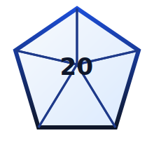

# DM Copilot Skills

<div align="center">
  

 # DM Copilot Skills

<div align="center">
  

  ## My Dungeon Master Toolkit
</div>

# DM Copilot Skills

<div align="center">
  

  ## My Dungeon Master Toolkit
</div>

## Why I built this

I put this repository together to help me better prepare for my campaigns. Over time, these skills have become a pretty reliable part of my workflow. Instead of wrestling with a generic AI to get usable D&D content, I loaded it with specific instructions that force it to think like a co-DM.

These aren't just prompts; they are reusable workflows that I use to design adventures, NPCs, monsters, items, and on-the-fly campaign material.

Read about SKILL.md here: [agentskills.io](https://agentskills.io/home)

## How I use it

My workflow is simple, and it makes the copilot surprisingly consistent:

1.  **Loading Behavior:** The copilot reads `AGENTS.md` first to understand the "house rules."
2.  **Picking a Skill:** Based on what I need (a monster, a rumor, a dungeon), it grabs the right skill from `.agents/skills/`.
3.  **Staying Structured:** The skill keeps the AI focused on process, constraints, and output format, so I don't get fluffy, unusable text.
4.  **Rolling Dice:** Sometimes I run the helper scripts to generate tarot spreads or text fragments for inspiration.
5.  **Getting Results:** I get table-ready content—hooks, scenes, stats, and flavor text—ready to drop into my notes.

## My Favorite Methodologies

These two methods are the core of how I break writer's block:

## My Favorite Methodologies

These two methods are the core of how I break writer's block and force the AI to be more creative:

### The Tarot Reader (`dnd-tarot-reader`)
When I'm stuck on where a plot is going, I use this. It deals a spread and forces the AI to interpret the symbolism.
*   **What it does:** Deals 3 or 5 cards from a dataset.
*   **How the agent uses it:** The agent takes the pulled tarot cards and uses them strictly as inspiration for the narrative.
*   **Why I like it:** I found that feeding the LLM these random cards makes it produce much more randomized content. Instead of falling back on standard clichés, the AI has to interpret the specific symbols, which leads to unexpected quest hooks and twists I wouldn't have planned myself.

### The Storymancer (`dnd-storymancer`)
This is my go-to for names, relics, or weird motifs.
*   **What it does:** Pulls random 3-8 word fragments from source books (bibliomancy).
*   **How the agent uses it:** It uses these random text fragments as a creative seed to build names, hooks, or artifacts.
*   **Why I like it:** I've noticed this technique makes the LLM output significantly more randomized and varied results. By forcing the AI to adapt to weird text fragments, the output feels fresh and less "AI-generated," giving me high-variance creative seeds that feel distinct from standard fantasy tropes.

## The Skills I Rely On

I've honed this list to cover almost everything I need during prep:

- `statblock-designer`: For when I need a monster that fills a specific combat niche.
- `npc-designer`: For social NPCs, rivals, and patrons who need to feel real.
- `scenario-designer`: For compact adventures and mysteries.
- `item-designer`: For magic items and cursed objects that aren't just "+1 swords."
- `spell-designer` & `feat-designer`: For custom player options and rewards.
- `economy-appraiser`: To make sure I'm not undervaluing powerful items.
- `skill-builder`: For when I want to add a new workflow to this repository.

## Repository structure

```text
.agents/
  skills/
AGENTS.md
assets/
```

## Utility Scripts

I use these scripts to inject some chaos into the AI's logic:

| Script | What it does | How to run it |
| :--- | :--- | :--- |
| **deal-spread.js** | Deals a random tarot spread (JSON or text). | `node .agents/skills/dnd-tarot-reader/scripts/deal-spread.js --spread 3 --format json` |
| **pick-fragment.js** | Pulls random text fragments for bibliomancy. | `node .agents/skills/dnd-storymancer/scripts/pick-fragment.js --count 3 --format json` |

## Final Thoughts

I use these skills to make my prep faster and more creative, and I've found them to be pretty reliable for generating content that actually fits 5e mechanics (treating 2024 rules as primary). If you're looking to extend your own AI copilot, feel free to load this up and adapt the skills to your own campaign style.

# DM Copilot Skills

<div align="center">
  

  ## My Dungeon Master Toolkit
</div>

## Why I built this

I put this repository together to help me better prepare for my campaigns. Over time, these skills have become a pretty reliable part of my workflow. Instead of wrestling with a generic AI to get usable D&D content, I loaded it with specific instructions that force it to think like a co-DM.

These aren't just prompts; they are reusable workflows that I use to design adventures, NPCs, monsters, items, and on-the-fly campaign material. If you're like me and you need your digital assistant to understand the difference between a CR 3 brute and a plot-critical villain, this pack is for you.

## How I use it

My workflow is simple, and it makes the copilot surprisingly consistent:

1.  **Loading Behavior:** The copilot reads `AGENTS.md` first to understand the "house rules."
2.  **Picking a Skill:** Based on what I need (a monster, a rumor, a dungeon), it grabs the right skill from `.agents/skills/`.
3.  **Staying Structured:** The skill keeps the AI focused on process, constraints, and output format, so I don't get fluffy, unusable text.
4.  **Rolling Dice:** Sometimes I run the helper scripts to generate tarot spreads or text fragments for inspiration.
5.  **Getting Results:** I get table-ready content—hooks, scenes, stats, and flavor text—ready to drop into my notes.


## The Skills I Rely On

I've honed this list to cover almost everything I need during prep:

- `statblock-designer`: For when I need a monster that fills a specific combat niche.
- `npc-designer`: For social NPCs, rivals, and patrons who need to feel real.
- `scenario-designer`: For compact adventures and mysteries.
- `item-designer`: For magic items and cursed objects that aren't just "+1 swords."
- `spell-designer` & `feat-designer`: For custom player options and rewards.
- `economy-appraiser`: To make sure I'm not undervaluing powerful items.
- `skill-builder`: For when I want to add a new workflow to this repository.

## Repository structure

```text
.agents/
  skills/
AGENTS.md
assets/
```

## Utility Scripts

I use these scripts to inject some chaos into the AI's logic:

| Script | What it does | How to run it |
| :--- | :--- | :--- |
| **deal-spread.js** | Deals a random tarot spread (JSON or text). | `node .agents/skills/dnd-tarot-reader/scripts/deal-spread.js --spread 3 --format json` |
| **pick-fragment.js** | Pulls random text fragments for bibliomancy. | `node .agents/skills/dnd-storymancer/scripts/pick-fragment.js --count 3 --format json` |

## Final Thoughts

I use these skills to make my prep faster and more creative, and I've found them to be pretty reliable for generating content that actually fits 5e mechanics (treating 2024 rules as primary). If you're looking to extend your own AI copilot, feel free to load this up and adapt the skills to your own campaign style.
